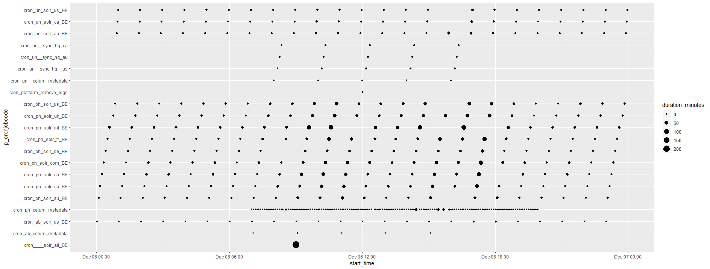
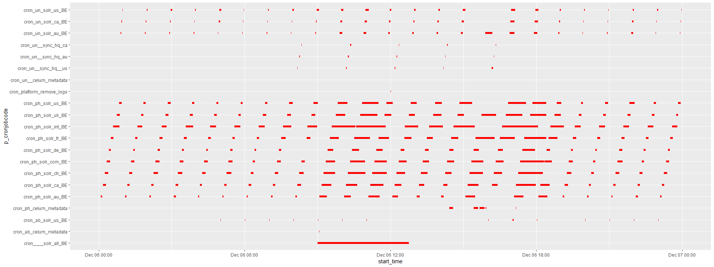
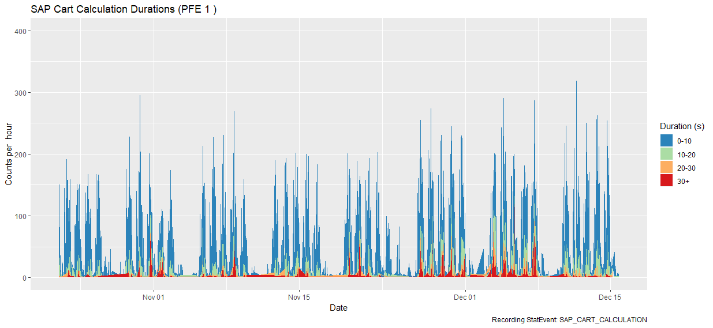
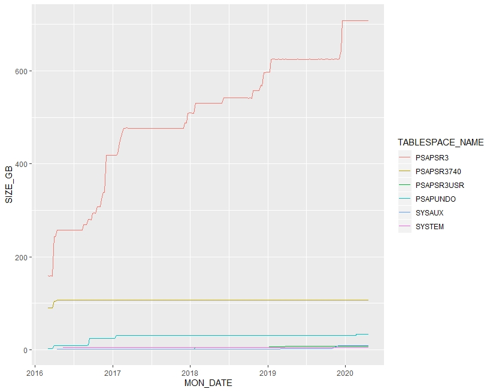

# Core

Objects have a `class`, ex:

* character
* integer
* numeric
* logical
* factor (categorical)

Objects hava a `type`, ex:

* vector
* list


## Data Structures

|Homogeneous|Heterogeneous
------------|------------
1d|Atomic vector|List
2d|Matrix|Data frame
nd|Array


### Vector

Salars are vectors of length 1

Vectors have a `type` (character, integer, numeric, logical, complex, raw)
Vecotrs have a `length`
Vectos have `attributes` (a named list associated with an object; most attributes lost when modifying a vector).

The following attributes are not lost when modifying a vector:

 * `Names`, a character vector giving each element a name (`names(x)`).
 * `Dimensions`, used to turn vectors into matrices and arrays (`dim(x)`).
 * `Class`, used to implement the S3 object system (`class(x)`).


Function|Description
--------|--------------------------------------------------------------------------
`str(x)`|"Structure": a compact, human readable description of an R data structure
`attr(x, "y")`|Display attribute "y" of vector "x"
`attr(x, "y") <- value`|Assign "value" to attribute "y" of vector "x"
`attributes(x)`|List the attributes of vector "x"
`names(y) <- c('a')`|Assign a name vector containing one element, "a", to the vector "y" (i.e. only first element of "y" will be assigned a name)
`names(y)[[1]] <- c('a')`|Change the name of the first element of "y"

**Note**

`is.vector()` does not test if an object is a vector. Instead it returns `TRUE` only if the object is a vector with no attributes apart from names.

&nbsp;

#### Samples Session: vector basics
```{r}
v <- c(name = 1:3)
str(v)
length(v)
attributes(v)
v
is.atomic(v)
is.list(v)
is.vector(v)
attr(v, "y") <- "hello"
v
attr(v,"y")
is.vector(v)
is.atomic(v)
typeof(v)
```

### Factor

A factor is a vector that can contain only predefined values, and is used to store categorical data. Factors are **built on top of integer vectors** using two attributes:

 * the class, **factor**, which makes them behave differently from regular integer vectors,
 * and the **levels**, which defines the set of allowed values. 

Use `stringsAsFactors = FALSE` when loading data to prevent the automatic conversion of character vectors into factors.  Create the factors manually if required.

It’s usually best to explicitly convert factors to character vectors if you need string-like behaviour.

### Matrix, Array


Vector|Matrix|Description
------|------|-------------------------------------------------------------------
c()|rbind()<br>cbind()|
length()|nrow()<br>ncol()|
name()|rownames()<br>colnames()|

### Data Frame

It’s a common mistake to try and create a data frame by `cbind()`ing vectors together. This doesn’t work because `cbind()` will create a matrix unless one of the arguments is already a data frame. Instead use `data.frame()`

```{r}
data.frame(a = 1:2, b = c("a", "b"), stringsAsFactors = FALSE)
```


 
### Subsetting

Type|Simplifying|Preserving
---------|---------|----------
Vector|x&#91;[1]&#93; |x[1]
List|x&#91;[1]&#93; |x[1]
Factor|x[1:4, drop = T]|x[1:4]
Array|x[1, ] or x[, 1]|x[1, , drop = F] or x[, 1, drop = F]
Data frame|x[, 1] or x&#91;[1]&#93;|x[, 1, drop = F] or x[1]

#### Vector

* Positive integers return elements at the specified positions
* Negative integers omit elements at the specified positions
* Logical vectors select elements where the corresponding logical value is TRUE
* Character vectors to return elements with matching names

#### List

* `[` always returns a list
* 

Subsetting: use a 1d index for each dimention, separated by comma

### Joining

Outer join: merge(x = df1, y = df2, by = "CustomerId", all = TRUE)

Left outer: merge(x = df1, y = df2, by = "CustomerId", all.x = TRUE)

Right outer: merge(x = df1, y = df2, by = "CustomerId", all.y = TRUE)

Cross join: merge(x = df1, y = df2, by = NULL)

# Code Samples

## CronJob Analysis

```{r eval=FALSE, include=TRUE}
setwd("c:/scratch/RAnalysis/HybrisCronJobs")
#install.packages("ggplot2")
library(ggplot2)


####################################
# Data Source
####################################

# Generate data from a quer:

#  select h.p_cronjobcode
#        ,convert(varchar, h.p_starttime, 20) AS start_time
#  	  ,convert(varchar, h.p_endtime, 20) AS end_time
#        ,DATEDIFF(minute, h.p_starttime, h.p_endtime) as duration_minutes
#    from cronjobhistories h
#    where h.p_cronjobcode like 'cron%'
#      and h.p_starttime >= '20181206'
#      and h.p_endtime < '20181207'
#    order by 1, 2 desc

# Creating a table in the form of:

#  p_cronjobcode	start_time	end_time	duration_minutes
#  cron____solr_all_BE	2018-12-06 09:00:09	2018-12-06 12:45:10	225
#  cron_ab_celum_metadata	2018-12-06 15:04:13	2018-12-06 15:04:17	0
#  cron_ab_celum_metadata	2018-12-06 13:04:06	2018-12-06 13:04:07	0


####################################
# Functions:
####################################

setClass("posix_date_time")
setAs("character", "posix_date_time", function(from) as.POSIXct(from, format="%Y-%m-%d %H:%M:%S"))

load_file <- function(filename) {
  
  occurrences <- read.csv(
    filename,
    header = TRUE,
    sep = "\t",
    colClasses = c("character", "posix_date_time", "posix_date_time", "numeric"),
    stringsAsFactors = FALSE
  )  
  
  return (occurrences)
}

####################################
# Mainline:
####################################


durations <- load_file("rawData/cron_job_durations_20181217.txt")

#durations_over_a_minute <- durations[durations$duration_minutes > 0, ]
durations_over_a_minute <- durations

order_by_job <- durations[order(durations_over_a_minute$p_cronjobcode, durations_over_a_minute$start_time), ]

# Cronjob plot of start times, duration expressed as size of dot
ggplot(order_by_job, aes(x = start_time, y = p_cronjobcode, size = duration_minutes)) +
    geom_point()

# Cronjob plot of job runs, duration expressed as length of line
ggplot(order_by_job, aes(y = start_time, x = p_cronjobcode)) +

  geom_linerange(
    aes(ymin = start_time, ymax = end_time),
    color = "red",
    size = 2
  ) +
    
  scale_y_datetime(
        minor_breaks = seq(from = as.POSIXct("2018-12-07 0:00"),
                             to = as.POSIXct("2018-12-08 00:00"),
                             by = "15 mins")
  ) +
  
  coord_flip() 
```






## Stacked area chart

```{r eval=FALSE, include=TRUE}
####################################################
# Recording StatEvent: SAP_CART_CALCULATION
###################################################


# Extracted from Hybris console logs, loglines with the following format:
#
#   INFO   | jvm 1    | srvmain | 2018/12/17 09:19:34.069 | INFO  [PerfStats collector] [StatsContainer] Recording StatEvent: SAP_CART_CALCULATION - duration: 4579 - success: true - timeout: false

#
# Data file format:
#
#   date | requestDuration
#   2018/10/24 14:17:34.647 | 812
#   2018/10/24 14:17:35.629 | 1763
#   2018/10/24 14:17:36.395 | 2482
#
# Extraction script:
#
# export OUTPUT_FILE=/c/scratch/RAnalysis/01_RecordingStatEvent_SAP_CART_CALCULATION/processedData/PFE1_SAP_CART_CALCULATION.out
# echo "date|duration" > $OUTPUT_FILE
# ack "Recording StatEvent: SAP_CART_CALCULATION" console*.log | sed 's/^.*srvmain |//g' | sed 's/INFO.*duration: //g' | sed 's/ - .*//g' | sort -u >> $OUTPUT_FILE


# ---------------------------
# Environment
# ---------------------------

setwd("c:/scratch/RAnalysis/01_RecordingStatEvent_SAP_CART_CALCULATION")

# install.packages("data.table")
# install.packages("dplyr")
library(ggplot2)
library(lubridate)
library(data.table)
library(dplyr)

# Introduce a new type to avoid the warning message when calling the "setAs" function using this type
setClass("posix_date_time")

# Convert an object of type "character" to an object of type "posix_date_time" with the given function
setAs( from = "character",
       to = "posix_date_time",
       def = function(from) { as.POSIXct(from, format="%Y/%m/%d %H:%M:%S") }
)


# ---------------------------
# Configuration
# ---------------------------

file_to_process <- c("processedData/PFE1_SAP_CART_CALCULATION.out",
                     "processedData/PFE2_SAP_CART_CALCULATION.out"
)

node <- 2

filter_min_date <- as.POSIXct("2018-10-22")  # inclusive
filter_max_date <- as.POSIXct("2018-12-17")  # exclusive

filter_duration <- 10  # i.e. exclude durations less than this many seconds (exclusive)

granularity <- "hour"

duration_buckets <- c(-Inf,10,20,30, Inf)
duration_labels <- c("0-10", "10-20", "20-30", "30+")


# ---------------------------
# Functions
# ---------------------------

load_file <- function(filename) {
   
    durations <- read.csv(
        filename,
        header = TRUE,
        sep = "|",
        colClasses = c("posix_date_time", "numeric"),
        stringsAsFactors = FALSE
    )
   
    return(durations)
   
} 


# ---------------------------
# Mainline
# ---------------------------


durations <- load_file(file_to_process[node])   # load as dataframe
durations <- filter(durations, date >= filter_min_date & date < filter_max_date)
setDT(durations)                                # converts df to a dt inline
durations[, duration := round(duration/1000)]   # convert ms to sec.  ":=" implies inline

# Add new column based on truncated date granularity (an "hour", or "10 mins", etc)
durations[ , granule := floor_date(durations$date, granularity)]


# The "gaps and islands": create a set of all timestamps of interest
all_granules <- data.table(granule = seq.POSIXt(from = filter_min_date, to = filter_max_date, by = granularity))

# Fill the gaps based on the generated sequence
durations <- right_join(durations, all_granules, by = "granule")

# Filled gaps have an NA duration value which we wish to replace with "0"
mutate(durations, duration = if_else(is.na(duration), 0, duration))


# Bucket data based on duration length
durations$bucket <- cut(durations$duration,
                        breaks = duration_buckets,
                        labels = duration_labels
)


# Aggregate counts by granule and duration bucket
aggregated_durations <- aggregate(
    durations$bucket,
    by = list(durations$granule, durations$bucket),
    FUN = "length"
)

names(aggregated_durations) <- c("Date", "DurationBucket", "Count")


# A stacked area graph:

ggplot(
    aggregated_durations,
    aes( x = aggregated_durations$Date,
         y = aggregated_durations$Count,
         group = aggregated_durations$DurationBucket,
         fill = aggregated_durations$DurationBucket
    )
) +
    ylim(0, 400) +
   
    geom_area(position = "stack") +
   
    scale_fill_brewer(palette="Spectral", direction = -1) +
   
    labs(x = "Date",
         y = paste("Counts per ", granularity),
         fill = "Duration (s)",
         title = paste("SAP Cart Calculation Durations (PFE", node, ")"),
         #         subtitle = "Sub-10s requests filtered",
         caption = "Recording StatEvent: SAP_CART_CALCULATION"
    )
```



## Box Plot

```{r eval=FALSE, include=TRUE}
#  zgrep "purchaseOrderRequestExecutor.*Connection leased.*total allocated" ./*.gz |
#      sed 's/^.*srvmain |//g'  |
#      sed 's/DEBUG.*total allocated: //g' |
#      sed 's/ of 100]//g' >
#      /c/scratch/RAnalysis/04_PurchaseOrderThreadsAllocated/raw_data/PFE2.out


setwd("c:/scratch/RAnalysis/04_PurchaseOrderThreadsAllocated")

# install.packages("data.table")
# install.packages("dplyr")
library(ggplot2)
library(lubridate)
# library(data.table)
# library(dplyr)


# Introduce a new type to avoid the warning message when calling the "setAs" function using this type
setClass("posix_date_time")

# Convert an object of type "character" to an object of type "posix_date_time" with the given function
setAs( from = "character",
       to = "posix_date_time",
       def = function(from) { as.POSIXct(from, format="%Y/%m/%d %H:%M:%S") }
)


# ---------------------------
# Configuration
# ---------------------------

file_to_process <- c(
    "raw_data/PFE1.out",
    "raw_data/PFE2.out"
)


# ---------------------------
# Functions
# ---------------------------

load_file <- function(filename) {
   
    durations <- read.csv(
        filename,
        header = TRUE,
        sep = "|",
        colClasses = c("posix_date_time", "numeric"),
        stringsAsFactors = FALSE
    )
   
    return(durations)
   
} 


# ---------------------------
# Mainline
# ---------------------------

pfe1 <- load_file(file_to_process[1])
pfe2 <- load_file(file_to_process[2])

pfe1$granule <- floor_date(pfe1$Date, "day")
pfe2$granule <- floor_date(pfe2$Date, "day")


col_names <- c("Date", "Count")
names(pfe1) <- col_names
names(pfe2) <- col_names

ggplot(pfe1) +
   
    geom_boxplot(aes(x = Date, y = Count, group = granule)) +

    labs(x = "Date",
         y = "Concurrent Thread Count",
         title = "PFE1 PurchaseOrderThreadsAllocated"
    )

ggplot(pfe2) +
   
    geom_boxplot(aes(x = Date, y = Count, group = granule)) +
   
    labs(x = "Date",
         y = "Concurrent Thread Count",
         title = "PFE2 PurchaseOrderThreadsAllocated"
    )
```


## JDBC example

```{r eval=FALSE, include=TRUE}
# install.packages("RJDBC")

library(RJDBC)
library(ggplot2)

SID = "ECP"

drv <- JDBC(driverClass="oracle.jdbc.OracleDriver", classPath="/Oracle/app/client/glennh/product/12.2.0/client_1/jdbc/lib/ojdbc8.jar"," ")
con <- dbConnect(drv, "jdbc:oracle:thin:@myserver:1521:mydb", "user","****")

query <- paste("
  select tablespace_name
        ,mon_date
        ,TRUNC(case when percentage_free = 0 then null else free_mb / percentage_free end / 10) AS size_gb
    from tablespace_statistics
    where sid = '", SID, "'
      and TRUNC(case when percentage_free = 0 then null else free_mb / percentage_free end / 10) > 1
    order by tablespace_name, mon_date
", sep="")

df <- dbGetQuery(con, query)
dbDisconnect(con)

df$MON_DATE <- as.Date(df$MON_DATE, format = "%Y%m%d")


ggplot(data = df, aes(x=MON_DATE, y=SIZE_GB)) + geom_line(aes(colour=TABLESPACE_NAME))
```




# Appendix

## Functions

Function|Description
--------|--------------------------------------------------------------------------------
installed.packages()|List packages installed in system
library()|List packages installed in system
old.packages()|List packages having a newer version
update.packages()|Update all packages
detach("package:ggplot2" unload=TRUE)|Unload the ggplot2 package
remove.packages("ggplot2")|Remove ggplot2 from the library
version|Version of R
sessionInfo()|session info

Table: Package manipulation


Function|Description
------------------------------------------|--------------------------------------------------------------------------------
class()|The class of an object: character, integer, numeric, logical, factor (categorical), ...
str()|The structure of an object: class, rows, cols, length, sample data
length()|Number of items in a vector
dim(), nrow(), ncol()|Dimensions, Number of rows, Number of columns
names(), colnames(), rownames()|Label a vector
print(), head(), tail()|Display object on console
summary()|Summary statistics for numeric data and performs tabulations for categorical data

Table: Typing

 
Function|Description
-------|--------------------------------------------------------------------------------
all()| any
any()| which
which()|indexes matching criteria

Table: Logical

## Libraries

A `library` is the place where the package is located on your computer.
A `package` is a collection of functions, data, and code.
Use `install.packages("ggplot2")` to download a package from CRAN and add it to the library. Use `library(ggplot2)` to load the pakage into R from the library.  To install from GitHub: `install_github("author/package")`

Library|Description
------------------------------------------|--------------------------------------------------------------------------------
lubridate|Date manipulation
stringr|String manipulation
purrr|Apply functions, nested data  
tidyR|Reshape data
data.table|Extends dataframe, apparently more efficient. More subsetting options.
dplyr|SQL-like operations
tidyr|Reshape data (pivots, splits, fill, ...)
readr|Data loading
ggplot2|Visualizations
help(package="ggplot2")|List the functions of ggplot2
browseVignettes("ggplot2")|Extended examples for a package

## References

[Advanced R](http://adv-r.had.co.nz/Subsetting.html)

[CRAN Repositor](https://cran.r-project.org/web/packages/)

[R Documentation](https://www.rdocumentation.org/)

[Language Tutorial](https://r4ds.had.co.nz/iteration.html)
